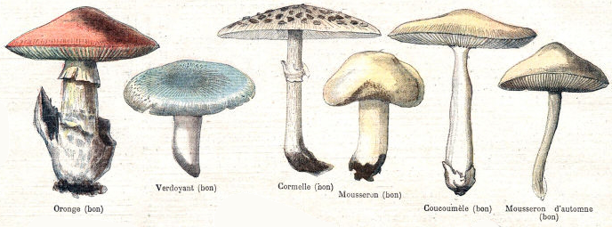

# shroom
Clojure/script library to produce Graphviz dot format

## Usage

`[shroom "0.1.1"]`

A bit of a reworking of Zac Tellman's Rhizome library with the following changes:

- Works in Clojurescript.
- Only produces dot output. Feeding that into graphviz is up to you.
- no tree->dot function.
- supports nested clusters.
- supports setting `rank=same` for fine control of layout in Graphviz' dot algorithm.
- tweaked interface to the main function.

The principle function is `graph->dot` which (like Rhizome) takes two parameters: `nodes` (a list of nodes in the graph) and `adjacent` (which is a function that takes a node and returns adjacent nodes).

These can be followed by zero or more of the following keyword arguments:

| name | description |
|------|-------------|
| `:directed?` | whether the graph should be rendered as a directed graph, defaults to true |
| `:vertical?` | whether the graph should be rendered top-to-bottom, defaults to true |
| `:node->descriptor` | takes a node, and returns a map of attributes onto values describing how the node should be rendered |
| `:edge->descriptor` | takes the source and destination node, and returns a map of attributes onto values describing how the edge should be rendered |
| `:options` | a map of attributes onto values describing how the graph should be rendered |
| `:node->cluster` | takes a node and returns which cluster, if any, the node belongs to |
| `:root-cluster` | the root cluster (clusters must be arranged as a tree) |
| `:cluster->children` | takes a cluster and a seq of child (contained) clusters |
| `:cluster->descriptor` | takes a cluster and returns a map of attributes onto values describing how the cluster should be rendered |
| `:cluster->ranks` | takes a cluster and returns a seq of seqs of nodes, the nodes in each inner seq will be assinged `rank=same` |

Enjoy!

## License

MIT
